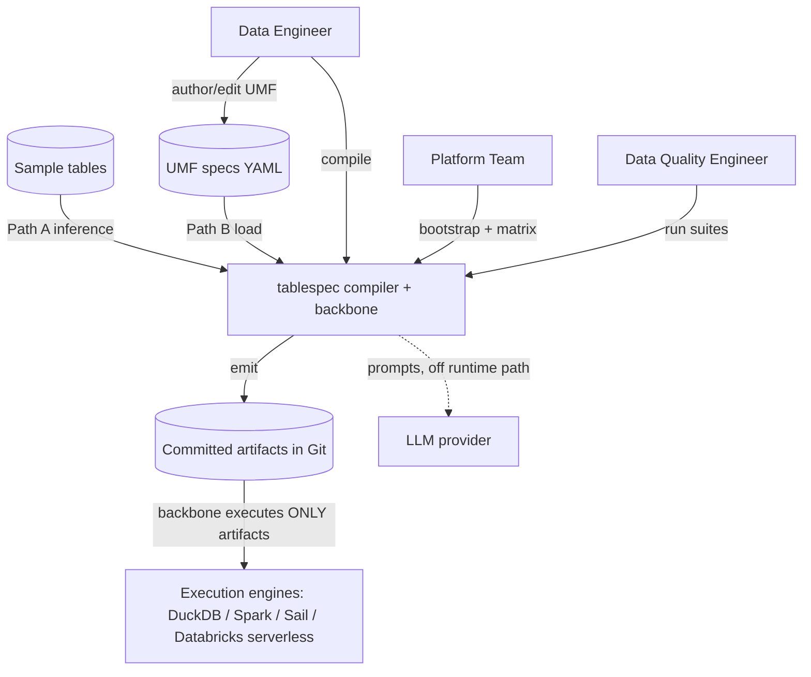
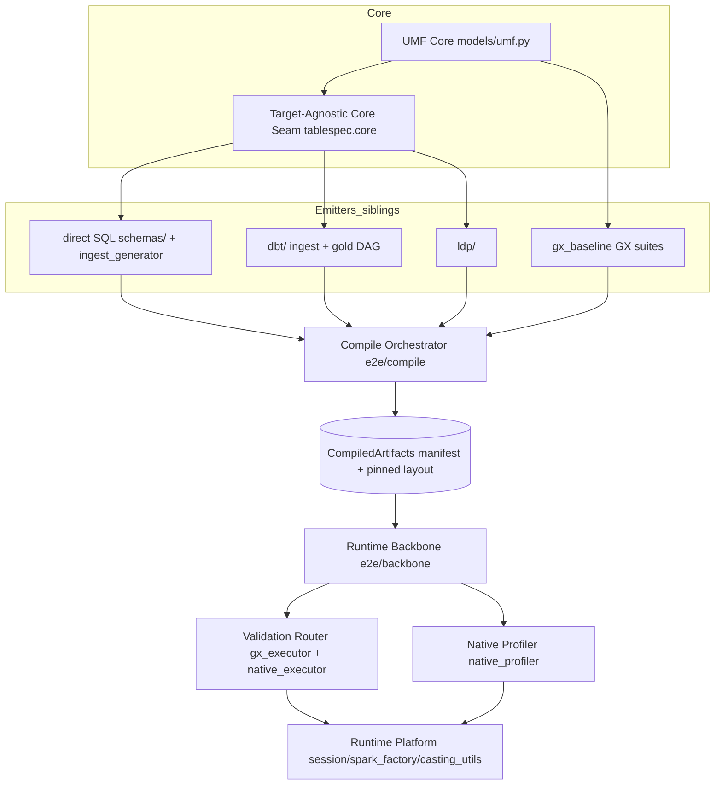
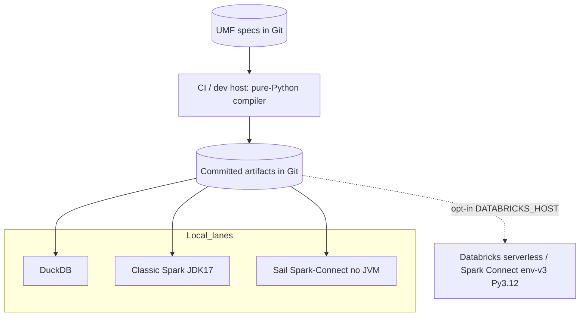

---
ddx:
  id: architecture
---

# Architecture

**Version**: 3.1
**Status**: Updated for the committed-artifact compiler, Connect-safe multi-engine runtime, guidebook, and operational app
**Last Updated**: 2026-07-22

**Requirements**: [../01-frame/prd.md](../01-frame/prd.md)
**Decisions**: [adr/ADR-010-spark-connect-serverless-runtime-model.md](adr/ADR-010-spark-connect-serverless-runtime-model.md),
[adr/ADR-011-connect-safe-gx-native-executor-routing.md](adr/ADR-011-connect-safe-gx-native-executor-routing.md),
[adr/ADR-012-compile-orchestrator-runtime-consumes-committed-artifacts.md](adr/ADR-012-compile-orchestrator-runtime-consumes-committed-artifacts.md),
[adr/ADR-013-target-agnostic-core-seam-sibling-emitters.md](adr/ADR-013-target-agnostic-core-seam-sibling-emitters.md),
[adr/ADR-018-guidebook-lineage-semantics.md](adr/ADR-018-guidebook-lineage-semantics.md),
[adr/ADR-019-app-configuration-precedence-and-provisioning-authority.md](adr/ADR-019-app-configuration-precedence-and-provisioning-authority.md)

## Scope

This architecture covers tablespec as **a compiler**: it turns one UMF (the single
source of truth) into the full set of committed, reviewable runtime artifacts —
direct SQL (raw→ingest + gold plans), dbt projects (ingest + gold DAG), Lakeflow
Declarative Pipelines (LDP), GX validation suites, and the schema family (DDL,
PySpark, JSON Schema) — and provides a runtime backbone that **executes only those
committed artifacts**, never re-deriving from UMF. The same UMF/artifacts run
first-class on classic Spark and on Databricks serverless / Spark Connect.

In scope: the UMF core, the multi-target emitters on a shared target-agnostic seam
(FR-19.x), the compile orchestrator + bootstrap (FR-18.x), Connect-safe validation
routing (FR-7.7/FR-7.8), the native profiler (FR-5.x), the runtime-platform
substrate (FR-20.x), multi-source acquisition (FR-21.x), static guidebook generation
(FR-22.x), and the first-party Databricks App deployability contract (FR-23.x) —
configuration precedence, declared metadata home, and idempotent provisioning.
The product microsite (`website/`, FEAT-030) is a documentation surface co-published
with the package index, not a runtime container.

Deliberately **outside** the architecture boundary: general-purpose SaaS product UI,
live warehouse ETL orchestration as a product surface, and dbt/LDP as user-facing
runtime dependencies (Non-Goal — they are test-only / emitted text).

This is the post-merge codebase. The legacy module-radial view (UMF core with
generators/validators/CLI radiating out) still describes the library surface; this
revision adds the **compile → committed-artifact → backbone** spine, the
**multi-engine, Connect-safe** execution model, and the **operator app + guidebook**
companions layered beside it.

## Level 1: System Context

| Element | Type | Purpose | Protocol |
|---------|------|---------|----------|
| Data Engineer | User | Authors/edits UMF; runs compile to produce committed artifacts | CLI / Python API |
| Data Quality Engineer | User | Generates + runs validation suites on classic Spark and Connect | Python API |
| Platform Team / Operator | User | Operates bootstrap/compile; deploys the Databricks App; owns engine matrix | CLI / CI / Databricks Apps |
| UMF specs (YAML) | External input | Single source of truth for schema, types, validation, relationships | File / Git |
| Sample tables | External input | Path-A inference source for bootstrap (schema + profile) | File / DataFrame |
| Git repo (committed artifacts) | External store | Diffable home of compiled SQL/dbt/LDP/suites; the runtime contract surface | File / Git |
| Execution engines | External system | Run the committed artifacts: DuckDB, classic Spark, Sail (Connect), Databricks serverless | SQL / Spark / Connect |
| Unity Catalog metadata home | External store | Declared (catalog, schema, volume) for app governance tables and output | UC / Volumes |
| LLM provider | External system | Enrichment prompts (docs, validation, relationships) — out of the runtime path | Prompt text |



## Level 2: Container Diagram

| Container | Technology | Responsibilities | Communication |
|-----------|------------|------------------|---------------|
| UMF Core | Pydantic (`models/umf.py`) | Single source of truth; runtime-validated schema, types, validation rules, relationships | In-process models |
| Target-Agnostic Core Seam | `tablespec.core` (renderer Protocol + logical-plan IR) | Cast layer, dependency IR, ref-rewriting shared by every emitter; importing it never pulls dbt/LDP (FR-19.1, ADR-013) | Python imports (one-way: emitter→core) |
| Emitters (siblings) | `schemas/`, `dbt/`, `ldp/`, `schemas/ingest_generator.py`, `gx_baseline.py` | Direct SQL (raw→ingest + gold plan), dbt (ingest + gold DAG), LDP, GX suites, schema family — each a sibling on the seam, none imports another (FR-19.x) | Pure-Python text/dict emission |
| Compile Orchestrator | `e2e/compile.py`, `e2e/manifest.py`, `e2e/paths.py` | Drive every emit seam, persist one committed artifact each under a pinned layout, return a `CompiledArtifacts` manifest (FR-18.1/18.2, ADR-012) | UMF list in → artifacts + manifest out |
| Runtime Backbone | `e2e/backbone.py`, `e2e/compiled.py`, `e2e/sql_runtime.py`, `e2e/gating.py` | Execute the committed artifacts (ingest → validate-raw → ingest-typed → validate-ingested → transforms); never re-derives from UMF, never imports the test tree (FR-18.3, ADR-012) | Reads manifest + artifacts; drives engines |
| Validation Router | `validation/gx_executor.py`, `validation/native_executor.py` | Run a compiled GX suite per-batch; route each expectation by DataFrame engine — classic Spark→GX `add_spark`, Connect→native df-API executor (FR-7.7/7.8, ADR-011) | Spark/Connect DataFrame API |
| Native Profiler | `profiling/native_profiler.py` | JVM-free Spark-SQL profiling (no Deequ); engine-correct `functions` dispatch from the DataFrame; feeds GX expectations (FR-5.1/5.2, ADR-009) | Spark/Connect DataFrame API |
| Runtime Platform substrate | `session.py`, `spark_factory.py`, `casting_utils.py` | Obtain a session, probe per-session capabilities, select the engine-correct `functions`/Column module from the DataFrame in hand — never a process-global `is_remote()` (FR-20.x, ADR-010) | PySpark / Spark Connect |
| Bootstrap entry points | `scripts/bootstrap_from_tables.py` (Path A), `scripts/bootstrap_from_specs.py` (Path B) | Produce the UMF list the compiler consumes; compile is path-agnostic (FR-18.4) | CLI → UMF list |
| Ingestion readers | `ingestion/` | Kind-dependent raw readers (delimited, parquet, json, jdbc) driven by UMF `source:` (FR-21.x, ADR-015) | Spark DataFrame API |
| Guidebook generator | `guidebook/` | Static HTML guidebook from a UMF directory (FR-22.x, ADR-018); CLI `tablespec guidebook` | Filesystem → HTML |
| Databricks App | `apps/data-profiling/` | Operator UI for guidebook, profiling, comparison, load results; desired deployability via declared config + provisioning (FR-23.x, ADR-019) | Streamlit / Databricks Apps |
| Product microsite | `website/` | Hugo/Hextra docs site co-published with Pages package index (FEAT-030, ADR-014) | Hugo → GitHub Pages |
| Library surface | `cli.py`, `excel_converter.py`, `umf_loader.py`, `umf_diff.py`, `sample_data/`, `quality/`, `inference/`, `prompts/` | The existing authoring/authoring-adjacent surface (CLI, Excel, change mgmt, sample data, baselines, inference, prompts) | CLI / Python API |



## Level 3: Component Diagram

### Compile Orchestrator and Backbone (the spine)

| Component | Container | Purpose | Notes |
|-----------|-----------|---------|-------|
| `compile_umfs()` | Compile Orchestrator | Path-agnostic entry: for each UMF run per-table seams, then whole-compile seams (gold dbt DAG, LDP); write `CompiledArtifacts` | `e2e/compile.py:72`; fail-closed gold DAG/LDP (absent, not wrong, when the set has no gold target) |
| Per-table seams | Compile Orchestrator | ingest SQL, DDL, PySpark, JSON, compiled GX suite, single-table dbt ingest project, optional single-target gold plan | `e2e/compile.py:158` `_compile_table`; UMF snapshot persisted for audit/reproducibility |
| `CompiledArtifacts` / `TableArtifacts` | Compile Orchestrator | Pinned-layout manifest resolved deterministically by the runtime | `e2e/manifest.py`; the runtime contract surface |
| Backbone runner + `_BackboneEngine` adapters | Runtime Backbone | Per-backend adapters (DuckDB / classic local Spark / Sail Connect) reuse conformance facades + shipped `split_sql_statements` / `canonical.to_json`; ship from `src/`, never import `tests/` | `e2e/backbone.py:1`; 5-stage staged runtime |
| `databricks_e2e_availability` gate | Runtime Backbone | Opt-in real-serverless leg (`DATABRICKS_HOST`); local success never depends on a remote workspace | `e2e/gating.py` |

### Validation Router (Connect-safe execution)

| Component | Container | Purpose | Notes |
|-----------|-----------|---------|-------|
| `GXSuiteExecutor.execute_suite/execute_staged` | Validation Router | Run a compiled suite in one batch pass; stage raw (string) vs ingested (typed) expectations | `validation/gx_executor.py:68`; staged routing matches the compiled co-mingled suite |
| `_is_connect_dataframe` | Validation Router | Detect Connect DataFrames by module (`pyspark.sql.connect.*`) | `gx_executor.py:212` |
| `_execute_native` routing | Validation Router | Connect DataFrame → native df-API executor; classic Spark → GX `add_spark` unchanged | `gx_executor.py:237`; per-expectation re-evaluation fails closed |
| `native_executor.evaluate_expectation` | Validation Router | Re-implements each baseline expectation type with ONLY the DataFrame API, picking the engine-correct `functions` module from the DataFrame | `validation/native_executor.py:1`; returns GX-shaped result so `report.py` is unaffected |

## Deployment

tablespec is a **library + compiler**, not a long-running service. "Deployment" here
means where the compiler runs and where its committed artifacts execute.

| Component | Infrastructure | Instances | Scaling | Backup / Recovery |
|-----------|----------------|-----------|---------|-------------------|
| Compiler (compile orchestrator) | CI runner or developer host; pure Python (no JVM) | Per compile invocation | N/A (batch) | Artifacts committed to Git; recompile is deterministic from UMF and produces the installable wheel/sdist plus the committed JSON pipeline artifacts |
| Committed artifacts | Git repository | One tree per compile | N/A | Git history = the recovery story; diffable, reviewable |
| Runtime backbone (local) | DuckDB / classic Spark (JDK 17) / Sail (Connect, no JVM) | Per test/CI lane | Engine-native | Re-run from the committed artifact tree; useful for development bootstrap validation |
| Runtime (production) | Databricks serverless / Spark Connect (env-v3, Python 3.12) | Workspace-managed | Serverless autoscale | Re-run from the committed artifact tree installed alongside the published `tablespec` wheel; runtime resolves `manifest.json` and the JSON pipeline artifacts and carries no source-time bootstrap/orchestration |



## Data Flow

The most important operational flow is the bootstrap → compile → backbone pipeline:
UMF compiles once into committed artifacts; the runtime then consumes only those
artifacts and validates Connect-safely.

```mermaid
sequenceDiagram
    participant PT as Platform/DE
    participant BS as Bootstrap (Path A/B)
    participant CO as compile_umfs()
    participant ART as Committed artifacts + manifest
    participant BB as Backbone runner
    participant VR as Validation router
    participant ENG as Engine (Spark / Connect)

    PT->>BS: sample tables (A) OR specs (B)
    BS-->>CO: list[UMF]  (path-agnostic)
    CO->>ART: persist ingest SQL, DDL, schemas, GX suite, dbt ingest+gold, LDP, gold plan
    CO-->>PT: CompiledArtifacts manifest
    BB->>ART: read manifest + artifacts (NO UMF, NO tablespec import at run time)
    BB->>ENG: 1. ingest raw->ROW (compiled split ingest SQL)
    BB->>VR: 2. validate RAW (compiled suite, staged)
    VR->>ENG: route by DataFrame engine (classic add_spark / native Connect)
    BB->>ENG: 3. ingest ROW->INGESTED (compiled cast + MERGE/INSERT)
    BB->>VR: 4. validate INGESTED (staged ingested expectations)
    BB->>ENG: 5. transforms: dbt parse always; dbt run + gold plan on duckdb/local-spark; LDP structure local, APPLY CHANGES only on real Databricks
```

## Quality Attributes

| Attribute | Target | Strategy | Verification |
|-----------|--------|----------|--------------|
| Multi-engine parity | Byte-for-byte identical typed-ingest/gold result vs the Spark-direct oracle | One shared canonicalizer (`canonical.to_json`); every emitter on the shared core seam (ADR-013) | Cross-engine conformance matrix (`tests/conformance/`); `conformance-acceptance.md` |
| Connect-safe execution | Same verdict on classic Spark and Spark Connect / serverless; no silent false-negatives | Engine-correct `functions` dispatch from the DataFrame; native df-API executor routing (ADR-010/011) | Sail (Connect) test lane + real-serverless opt-in leg; `serverless-compatibility.md` eval |
| Zero UMF↔artifact drift | Runtime never re-derives schema/transforms from UMF | Compile-once → committed artifacts; backbone consumes only artifacts; `src` never imports the test tree (ADR-012) | `test_core_encapsulation.py`; backbone reads manifest only; golden artifact suites |
| Dependency lightness | Profiling/runtime need no JVM, no Deequ; dbt/LDP not user-facing deps | Native Spark-SQL profiler; dbt + pysail in the dev (test-only) group, not user extras (ADR-009) | `pyproject.toml:51` NOTE + dev group; `test_src_never_imports_dbt` |
| Determinism | Same UMF compiles to the same artifacts | Stateless emit seams; pinned manifest layout | Byte-for-byte golden suites; recompile diff = empty |
| Optional-dependency isolation | `import tablespec` works without PySpark | Lazy PySpark imports in session/profiler/validation; `[spark]` extra boundary (ADR-003) | Import tests without the spark extra |

## Decisions and Tradeoffs

| Decision | Status | Rationale | Follow-up |
|----------|--------|-----------|-----------|
| ADR-009: native Spark-SQL profiler over PyDeequ | Accepted | Deequ is JVM/Connect-hostile and heavy; native SQL aggregations work on serverless and feed GX directly | FEAT-024, US-021 |
| ADR-010: Spark Connect / serverless is first-class; never assume a JVM `SparkContext` | Accepted | env-v3/Python-3.12 serverless has no client `SparkContext`; process-global `is_remote()` is wrong when sessions coexist | FEAT-025; Sail test lane |
| ADR-011: Connect-safe GX via per-expectation native-executor routing | Accepted | GX `add_spark` silently returns `success=False`/`result={}` on Connect; per-DataFrame routing fixes it without disturbing classic Spark | FEAT-025, US-022 |
| ADR-012: compile orchestrator; runtime consumes only committed artifacts | Accepted | Zero drift, diffable transforms, runtime carries no tablespec dependency | FEAT-026, US-023/024 |
| ADR-013: target-agnostic core seam with sibling emitters | Accepted | One cast/IR truth; emitters import-isolated; LDP is the proof obligation for the seam | FEAT-027, FEAT-028, US-025/026 |
| ADR-007: raw→ingest as a committed SQL artifact | Accepted | Transform is reviewable text, generated not wrapped at run time | FR-19.4 |
| ADR-015: discriminated source-shape contract with kind-dependent raw typing | Accepted (DUMP/PARQ/JDBC shipped; JSON backbone residual) | One `source:` declaration (delimited/parquet/jdbc/json) drives readers, casts, and suites; typed sources land native-typed raw — never string-parsed; JDBC is compiled read specs via Spark's connector, with secret-referenced credentials only | FEAT-031, US-039; story floor US-040/042/043/050; JSON residual bead `tablespec-9f98cf03` |
| ADR-018: guidebook lineage semantics | Accepted | Static HTML guidebook surfaces FK + derivation lineage without runtime coupling | FEAT-033, US-046 |
| ADR-019: app configuration precedence and provisioning authority | Accepted (desired deployability) | Env → connections.yaml → defaults; metadata home is a declared input; provisioning is idempotent | FEAT-034, US-047–049; implementation gaps in alignment beads |
| ADR-003: optional PySpark via `[spark]` extra | Accepted (extended by ADR-010) | Keeps the pure-Python core importable; boundary now also forbids assuming a `SparkContext` | dbt/pysail moved to dev group |
| dbt + pysail in the dev (test-only) group, not user extras | Accepted | Generating dbt/LDP is pure-Python text; the stacks are only needed to EXECUTE generated projects in tests | `pyproject.toml` dev group; `test_src_never_imports_dbt` |

## Appendix: Library Module Map (existing surface)

The compiler/runtime spine sits on top of the established library surface. The
module responsibilities below are unchanged from v2.0 and remain authoritative for
the non-compile surface.

### Core Layer

**models/umf.py** — Pydantic models; the single source of truth. All other modules
depend on these. Models enforce constraints at runtime (column name patterns,
unique names, type-specific requirements, extra-field rejection).

**type_mappings.py** — Central type-conversion hub (UMF → PySpark, JSON, GX
Spark). Case-insensitive, safe defaults for unknown types.

### Schema / Emission Layer

**schemas/generators.py** — Stateless SQL DDL / PySpark / JSON Schema generators.
**schemas/sql_generator.py** — `generate_sql_plan` (single-target gold plan,
views/CTE modes). **schemas/ingest_generator.py** — `generate_ingest_sql`
(raw DDL + typed DDL + raw→ingested transform; ADR-007). **schemas/dbt_generator.py**,
**schemas/relationship_resolver.py** — schema/relationship helpers.

**dbt/** — dbt emitter: `single_table.generate_dbt_project` (ingest project),
`project.generate_dbt_dag_project` (multi-table gold DAG), with `contracts`,
`schema_tests`, `selection` (`state:modified` from UMF diff), `seeds`,
`materialization`, `routing`, `registry`, `renderer`. Pure-Python text emission;
never imported at tablespec runtime.

**ldp/** — LDP sibling emitter: `project.generate_ldp_project`, `renderer`,
`expectations` (inline EXPECT / APPLY CHANGES). Sibling of dbt on the shared seam.

### Great Expectations Layer

**gx_baseline.py** — `BaselineExpectationGenerator` (deterministic expectations from
UMF) + `UmfToGxMapper`. **gx_constraint_extractor.py** — reverse extraction of value
sets/regex/formats from suites. **gx_schema_validator.py** — expectation-type
validation. **validation/gx_processor.py** — merge/dedupe AI suites; GX 1.6+ format.

### Profiling Layer

**profiling/native_profiler.py** — native, JVM-free Spark-SQL profiler (default);
`_functions_for(df)` selects the engine-correct `functions` module from the
DataFrame. **profiling/gx_expectation_builder.py** — profile → GX expectations.
**profiling/spark_mapper.py** — Spark schema → UMF (legacy compatibility, requires
PySpark). **profiling/types.py** — profile dataclasses.

### Validation Layer

**validation/gx_executor.py** — `GXSuiteExecutor` with staged execution and
Connect-vs-classic routing. **validation/native_executor.py** — Connect-safe df-API
re-implementations of each baseline expectation. **validation/table_validator.py** —
DataFrame validation against UMF (requires PySpark). **validation/report.py** —
result summarization. **umf_validator.py** — UMF-vs-JSON-schema + business rules.

### Runtime Platform Layer

**session.py** — `get_session`, `get_capabilities` (per-session capability probing,
cached by `id(spark)`). **spark_factory.py** — `SparkSessionFactory`. **casting_utils.py** —
Connect-aware casting. These realize FR-20.x and ADR-010.

### Other surface (unchanged)

CLI (`cli.py`), Excel (`excel_converter.py`, `excel_import_git.py`), change
management (`umf_loader.py`, `umf_diff.py`, `umf_change_applier.py`,
`changelog_generator.py`, `models/changelog.py`), sample data (`sample_data/`),
quality baselines (`quality/`), inference (`inference/domain_types.py`), formatting
(`formatting/`), prompts (`prompts/`), and utilities (`naming.py`, `date_formats.py`,
`merge.py`, `sync_baseline.py`, `dependency_resolver.py`).

### Optional Dependency Strategy

PySpark is isolated to the modules that require it (profiling native/spark mappers,
validation executors/table_validator, quality baseline service, merge, session,
spark_factory) and imported lazily so `import tablespec` succeeds without it
(ADR-003, extended by ADR-010). dbt and pysail live in the **dev (test-only) group**,
never user extras — generating dbt/LDP is pure-Python text emission, enforced by
`tests/test_core_encapsulation.py::test_src_never_imports_dbt`.

### Packaging and Distribution

- Build system: Hatchling with uv-dynamic-versioning.
- Distribution: GitHub Pages PyPI-compatible index.
- Versioning: Git tag-based via uv-dynamic-versioning (fallback: 0.0.0).
- The shipped wheel contains `src/` only — the backbone ships its deps from `src/`
  and never imports the `tests/` tree.
