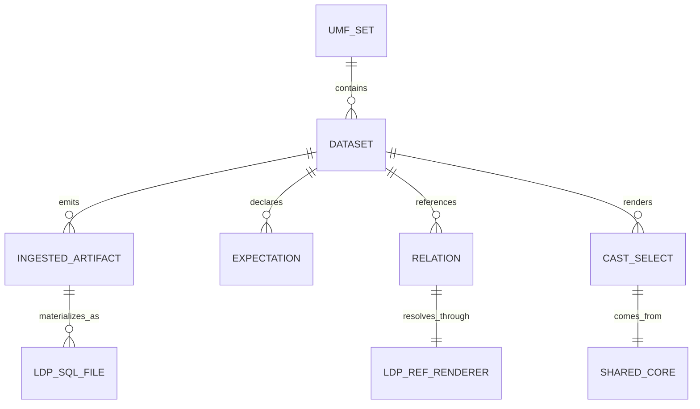
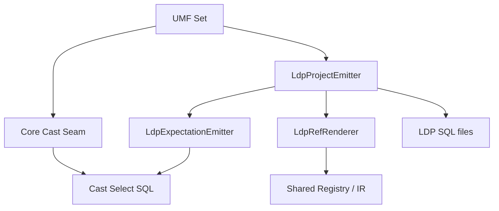

---
ddx:
  id: SD-028
---

# Solution Design

**Feature**: FEAT-028 - LDP Sibling Emitter | **Artifact**: `docs/helix/02-design/ldp-sibling-emitter.md`

## Scope

- Feature-level design for emitting a Lakeflow Declarative Pipelines (LDP)
  project from one UMF set as a sibling backend on the shared
  target-agnostic core seam.
- Governing artifacts: FEAT-028, ADR-013, PRD FR-19.1 / FR-19.3, and the
  existing direct-SQL and dbt emitter seams.
- This is the detailed design for the LDP emitter. It does not change
  `tablespec.core` semantics, `tablespec.dbt`, or the direct-SQL path.
- The emitter generates committed LDP SQL only. LDP execution remains
  Databricks-only; local tests cover structure, cast parity, and fail-closed
  behavior.

## Requirements Mapping

### Functional Requirements

| Requirement | Technical Capability | Component | Priority |
|------------|----------------------|-----------|----------|
| FR-19.1 shared target-agnostic core seam | Reuse `NodeRegistry`, `build_ingest_select`, `cast_column_sql`, and the `TableRenderer` protocol without importing another emitter | Core seam, `LdpProjectEmitter`, `LdpRefRenderer` | P1 |
| FR-19.3 LDP sibling emitter | Emit one reviewable LDP project from one UMF set as a committed runtime artifact | `LdpProjectEmitter` | P1 |
| LDP-01 pinned file layout | Write one `.sql` file per dataset under the LDP layout | `LdpProjectEmitter` | P1 |
| LDP-02 raw landing as streaming file ingestion | Emit `CREATE OR REFRESH STREAMING TABLE ... FROM STREAM read_files(...)` | `LdpProjectEmitter` | P1 |
| LDP-03 incremental ingested with PK | Emit streaming-table shell + `APPLY CHANGES INTO ... KEYS ... SEQUENCE BY ...` | `LdpProjectEmitter` | P1 |
| LDP-04 incremental ingested without PK | Emit a streaming table that appends the shared cast select over the raw stream | `LdpProjectEmitter` | P1 |
| LDP-05 snapshot ingested | Emit `CREATE OR REFRESH MATERIALIZED VIEW` for full reload | `LdpProjectEmitter` | P1 |
| LDP-06 gold dataset | Render the shared `SQLPlanGenerator` plan with bare LDP dataset references | `LdpProjectEmitter`, `LdpRefRenderer` | P1 |
| LDP-07 / LDP-08 / LDP-09 inline expectations | Translate nullability, primary key, and accepted-values expectations into LDP `EXPECT` clauses and `ON VIOLATION` actions | `LdpExpectationEmitter` | P1 |
| LDP-10 honest gaps | Emit uniqueness and FK intent as comments, not fabricated constraints | `LdpExpectationEmitter` | P1 |
| LDP-11 shared cast body | Keep ingested cast SQL character-identical to the dbt/direct shared cast select | Core seam, `LdpProjectEmitter` | P1 |
| LDP-12 fail closed | Reject cycles, dangling non-external refs, unknown relations, and physical-name collisions | `LdpProjectEmitter`, `LdpRefRenderer` | P1 |

### NFR Impact on Architecture

| NFR | Requirement | Architectural Impact | Design Decision |
|-----|------------|---------------------|-----------------|
| Encapsulation | Generation must not import Databricks or Spark runtime packages | The emitter stays text-only and depends only on the shared core seam | Keep `tablespec.ldp` isolated; enforce with `tests/test_core_encapsulation.py` |
| Determinism | Recompiling the same UMF set must produce byte-stable SQL | The emitter must avoid nondeterministic ordering and must render the same physical names consistently | Golden files cover the emitted LDP layout and bodies |
| Cast parity | LDP ingested casts must match the shared dbt/direct cast logic | The cast body must come from `build_ingest_select` / `cast_column_sql`, not a second implementation | Cross-engine parity tests compare the emitted cast select to the shared select block |
| Execution scope | LDP runs only on Databricks | Local CI can validate generation but not pipeline execution | Structure and parity are tested locally; end-to-end runtime behavior is a Databricks-only conformance tier |

## Solution Approaches

### Approach 1: Fork LDP-specific cast and reference logic
**Description**: Build the LDP emitter as a separate pipeline that re-implements
casts, ref rewriting, and expectation mapping in LDP-only code.
**Pros**: The emitter can be shaped entirely around LDP's syntax and execution
model.
**Cons**: Cast logic forks from dbt/direct emission, ref handling drifts, and
the shared-core claim becomes unprovable.
**Evaluation**: Rejected. It recreates the exact drift the shared seam exists to
prevent.

### Approach 2: Shared core, string-rewrite refs only
**Description**: Reuse the core IR and cast builder, but translate references by
string substitution over generated SQL.
**Pros**: Less new code than a full fork.
**Cons**: String rewriting is brittle, can fabricate phantom refs, and does not
fail closed on missing relations.
**Evaluation**: Rejected. It weakens the seam and makes error handling opaque.

### Approach 3: Shared target-agnostic core seam with a semantic LDP renderer
**Description**: Reuse the core IR, shared cast select, and semantic relation
resolution; render LDP dataset names through a dedicated `LdpRefRenderer`, and
emit LDP materialization and expectations as first-class SQL.
**Pros**: One cast truth across backends, fail-closed reference resolution,
deterministic output, and a genuinely different backend proves the seam is
target-agnostic.
**Cons**: LDP-specific gaps such as uniqueness and FK must stay honest and be
surfaced as comments instead of enforced constraints.
**Evaluation**: Selected. It is the only approach that keeps the core seam
shared while satisfying FR-19.3.

**Selected Approach**: Shared target-agnostic core seam with a semantic LDP
renderer.

**Architecture/ADR impact**: No new architecture decision is needed. This
design applies ADR-013 and the existing core seam contract.

## Domain Model

### Business Rules

1. **One core cast truth**: every ingested dataset body must come from the
   shared cast select, not a backend-specific reimplementation.
2. **Declared datasets, not ordered scripts**: LDP emission declares datasets
   and materializations; Databricks owns DAG ordering and execution.
3. **Expectations are first-class**: nullability, primary-key, and accepted
   values rules become inline expectations with explicit violation semantics.
4. **Honest constraints**: uniqueness and FK intent are comments unless the
   backend can enforce them directly.

## System Decomposition

### Component: LdpProjectEmitter
- **Purpose**: Build the full LDP project layout from a compiled UMF set.
- **Responsibilities**: Choose materialization per dataset, write dataset files,
  and preserve the pinned artifact layout.
- **Requirements Addressed**: FR-19.3, LDP-01, LDP-02, LDP-03, LDP-04,
  LDP-05, LDP-06.
- **Interfaces**: Consumes the shared core IR and shared cast select; writes
  LDP `.sql` artifacts.
- **Owned by TDs**: Dataset file layout details and any future story-level
  emission refinements.

### Component: LdpExpectationEmitter
- **Purpose**: Translate UMF validation facts into LDP `EXPECT` clauses.
- **Responsibilities**: Emit not-null and accepted-values checks, derive
  `ON VIOLATION` actions, and surface uniqueness/FK gaps as comments.
- **Requirements Addressed**: LDP-07, LDP-08, LDP-09, LDP-10.
- **Interfaces**: Consumes UMF expectation metadata; emits inline expectation
  SQL and comments.
- **Owned by TDs**: Exact syntax and formatting rules for generated expectation
  blocks.

### Component: LdpRefRenderer
- **Purpose**: Render relations as LDP dataset references.
- **Responsibilities**: Resolve relation names semantically, fail closed on
  unknown or invalid refs, and avoid cross-backend imports.
- **Requirements Addressed**: FR-19.1, LDP-06, LDP-12.
- **Interfaces**: Implements the `TableRenderer` protocol against the shared
  registry.
- **Owned by TDs**: Story-level ref resolution edge cases.

### Component: Core Cast Seam
- **Purpose**: Provide the shared cast select used by all emitters.
- **Responsibilities**: Build typed ingest selects once and keep output
  identical across backends.
- **Requirements Addressed**: FR-19.1, LDP-11.
- **Interfaces**: `build_ingest_select`, `cast_column_sql`, and the core IR.
- **Owned by TDs**: None. This remains a shared seam, not a backend-specific
  story surface.

### Component Interactions

## Technology Rationale

Only feature-specific choices are listed here. System-wide choices remain in
Architecture and ADRs.

| Layer | Choice | Why | Alternatives Rejected |
|-------|--------|-----|----------------------|
| Language/runtime | Python 3.12+ | Matches the library runtime and the existing compiler surface | A separate generation runtime would add another dependency surface |
| Target SQL | Databricks LDP SQL | It is the product target for FR-19.3 | Re-encoding LDP concepts in another DSL would not ship the desired artifact |
| Test engine | pytest + golden files + duckdb parity | It can verify generation, determinism, and shared-cast behavior locally | A Databricks-only test loop would hide regressions until deployment |
| Reference resolution | Semantic renderer over the shared registry | Prevents brittle string substitution and fails closed on unknown relations | SQL text rewriting was rejected as unsafe and hard to reason about |

## Traceability

| Requirement ID | Component | Design Element | Test Strategy |
|---------------|-----------|----------------|---------------|
| FR-19.1 | Core Cast Seam, LdpRefRenderer | Shared core IR, renderer protocol, import isolation | `tests/test_core_encapsulation.py`; core/backends import checks |
| FR-19.3 | LdpProjectEmitter | LDP project generation from one UMF set | LDP feature tests and golden SQL checks |
| LDP-01 / LDP-02 | LdpProjectEmitter | Pinned file layout and raw landing emission | Golden file layout assertions |
| LDP-03 / LDP-04 / LDP-05 | LdpProjectEmitter | Streaming-table vs materialized-view selection by ingestion mode | Backend unit tests over representative UMF fixtures |
| LDP-06 | LdpProjectEmitter, LdpRefRenderer | Gold dataset rendering over shared SQLPlanGenerator output | Gold plan golden files and ref-resolution tests |
| LDP-07 / LDP-08 / LDP-09 | LdpExpectationEmitter | Inline expectation syntax and violation routing | Expectation emitter unit tests |
| LDP-10 | LdpExpectationEmitter | Commented uniqueness/FK intent | Golden SQL assertions for constraint comments |
| LDP-11 | Core Cast Seam | Character-identical cast select reuse | Cross-engine duckdb parity tests |
| LDP-12 | LdpProjectEmitter, LdpRefRenderer | Fail-closed unknown relation and collision handling | Negative-path tests for unknown refs, cycles, and name collisions |

### Gaps

- No real-Databricks execution tier in this environment. Mitigation: keep the
  Databricks-only execution claim explicit and test structure plus parity
  locally.
- Streaming runtime semantics are not executed locally. Mitigation: cover them
  with generation tests and Databricks conformance in the future.
- There is no local LDP parser/linter. Mitigation: rely on deterministic golden
  output and fail-closed validation in the emitter.

## Concern Alignment

- **Concerns used**: `databricks-declarative-pipelines`, `unity-catalog`,
  `testing`, `verification`, and `architecture-style`.
- **Constraints honored**: The emitter is generated from the shared core seam,
  stays import-isolated, preserves deterministic output, and keeps runtime
  execution concerns on the Databricks side.
- **ADRs referenced**: ADR-013 governs the shared core seam; ADR-008 and
  ADR-007 remain the upstream compiler seam decisions.
- **Departures**: None. The design stays within the existing concern model and
  does not introduce a new platform assumption.

## Constraints & Assumptions

- **Constraints**: LDP is Databricks-only at runtime; uniqueness and FK are not
  row-local constraints; generator code must not depend on Databricks/Spark
  packages.
- **Assumptions**: The shared core IR remains stable enough to feed sibling
  emitters; the current dataset model covers the LDP cases in FEAT-028.
- **Dependencies**: FEAT-027, FEAT-026, ADR-013, and the existing conformance
  and encapsulation test surfaces.

## Risks

| Risk | Prob | Impact | Mitigation |
|------|------|--------|------------|
| Cast logic drifts from dbt/direct output | M | H | Keep cast emission in the shared core seam and verify parity with golden tests |
| A ref cannot be resolved but still emits a phantom dataset | L | H | Use fail-closed resolution in `LdpRefRenderer` and negative-path tests |
| Honest LDP gaps get faked as constraints | L | M | Emit comments for uniqueness/FK intent and assert the comment format in goldens |
| LDP execution semantics differ from the generated shape | M | M | Keep runtime claims scoped to Databricks-only execution and avoid pretending local tests cover more than generation/parity |
